<p align="center">
  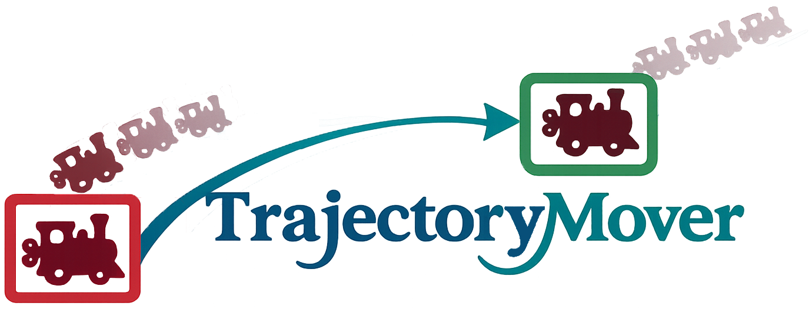
</p>

<h1 align="center">Generative Movement of Object Trajectories in Videos</h1>

<p align="center">
  <a href="https://chhatrekiran.github.io/"><strong>Kiran Chhatre</strong></a><sup>†‡</sup>
  ·
  <a href="https://hyeonho99.github.io/"><strong>Hyeonho Jeong</strong></a><sup>‡</sup>
  ·
  <a href="https://yulia.gryaditskaya.com/"><strong>Yulia Gryaditskaya</strong></a><sup>‡</sup>
  <br>
  <a href="https://www.kth.se/profile/chpeters"><strong>Christopher E. Peters</strong></a><sup>†</sup>
  ·
  <a href="https://paulchhuang.wixsite.com/chhuang"><strong>Chun-Hao Paul Huang</strong></a><sup>‡</sup>
  ·
  <a href="https://paulguerrero.net/"><strong>Paul Guerrero</strong></a><sup>‡</sup>
</p>

<p align="center">
  <a href="https://www.kth.se/en">
    
  </a>
  &nbsp;&nbsp;&nbsp;&nbsp;&nbsp;&nbsp;
  <a href="https://research.adobe.com/">
    
  </a>
</p>

<p align="center">
  <a href="https://www.kth.se/en"><sup>†</sup> KTH Royal Institute of Technology</a>
  &nbsp;|&nbsp;
  <a href="https://research.adobe.com/"><sup>‡</sup> Adobe Research</a>
</p>

<p align="center">
  <a href="https://chhatrekiran.github.io/trajectorymover/" style="padding-left: 0.5rem;">
    
  </a>
  <a href="https://arxiv.org/abs/2603.29092">
    
  </a>
  <a href="#bibtex" style="padding-left: 0.5rem;">
    
  </a>
</p>

---

## Abstract

<p align="left">
Generative video editing has enabled several intuitive editing operations for short video clips that would previously have been difficult to achieve, especially for non-expert editors. Existing methods focus on prescribing an object's 3D or 2D motion trajectory in a video, or on altering the appearance of an object or a scene, while preserving both the video's plausibility and identity. Yet a method to move an object's 3D motion trajectory in a video, i.e. moving an object while preserving its relative 3D motion, is currently still missing. The main challenge lies in obtaining paired video data for this scenario. Previous methods typically rely on clever data generation approaches to construct plausible paired data from unpaired videos, but this approach fails if one of the videos in a pair cannot easily be constructed from the other. Instead, we introduce TrajectoryAtlas, a new data generation pipeline for large-scale synthetic paired video data and a video generator TrajectoryMover fine-tuned with this data. We show that this successfully enables generative movement of object trajectories.
</p>

## News 🚩

- [31 March 2026] [arXiv is available](https://arxiv.org/abs/2603.29092)

## Method Overview

<p align="center">
  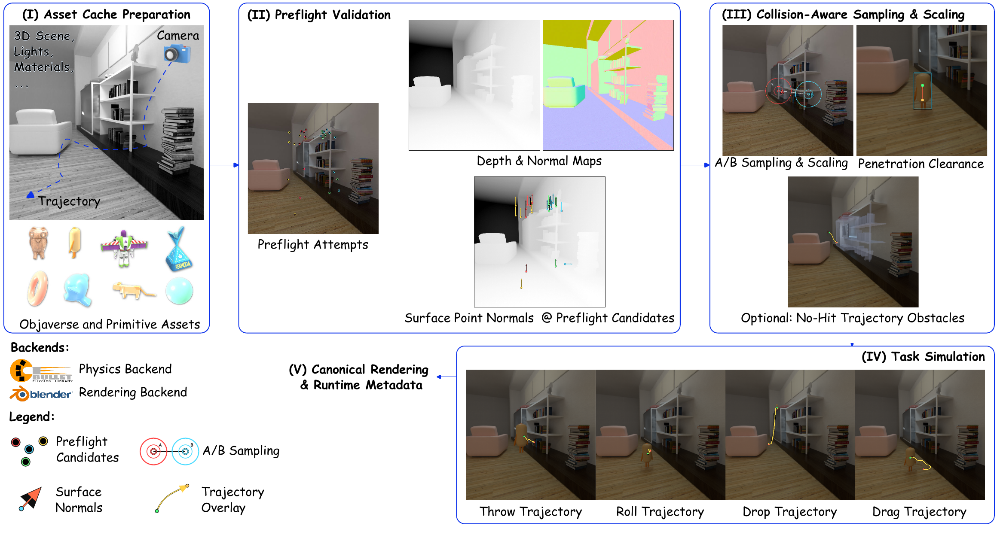
</p>
<p align="justify">
  <em><strong>TrajectoryAtlas data generation pipeline.</strong> The pipeline has five stages: Asset Cache Preparation, Preflight Validation, Collision Aware Sampling and Scaling, Task Simulation, and Canonical Rendering with Runtime Metadata. Inputs including camera, 3D scene, lights and materials, and Objaverse or primitive assets are converted to reusable collision caches, then skip-render preflight selects valid frames. Paired A/B placements with shared scale are filtered by visibility, support normal, and penetration clearance, and optional no-hit processing removes only non-structural obstacles in the trajectory corridor. Throw, drop, roll, and drag trajectories are simulated with Bullet and rendered with Blender into canonical RGB and binary segmentation videos.</em>
</p>

<table align="center" width="96%">
  <tr>
    <td width="49%" align="center" valign="top">
      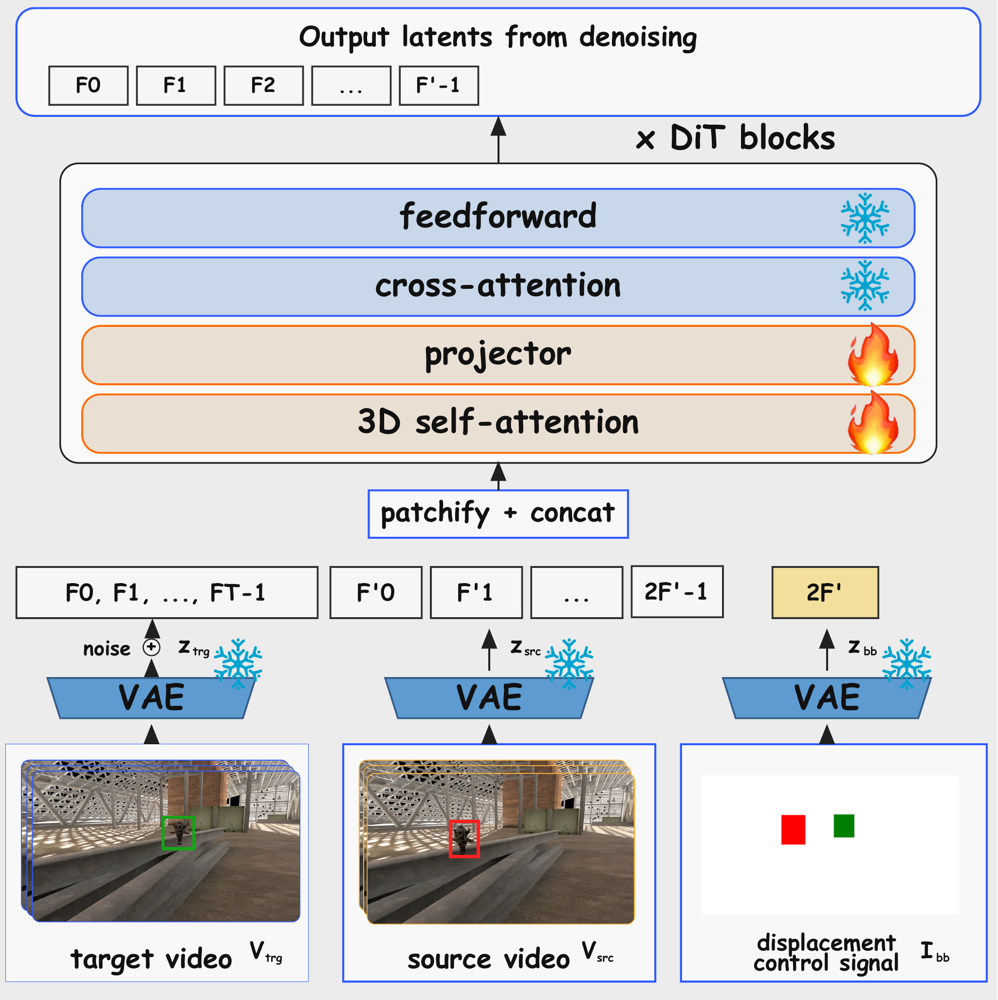
      <p align="justify">
        <em><strong>TrajectoryMover architecture.</strong> We concatenate three latent streams <code>z_trj</code>, <code>z_src</code>, and <code>z_bb</code> before denoising. In the control image, red marks the source box and green marks the target box.</em>
      </p>
    </td>
    <td width="2%"></td>
    <td width="49%" align="center" valign="top">
      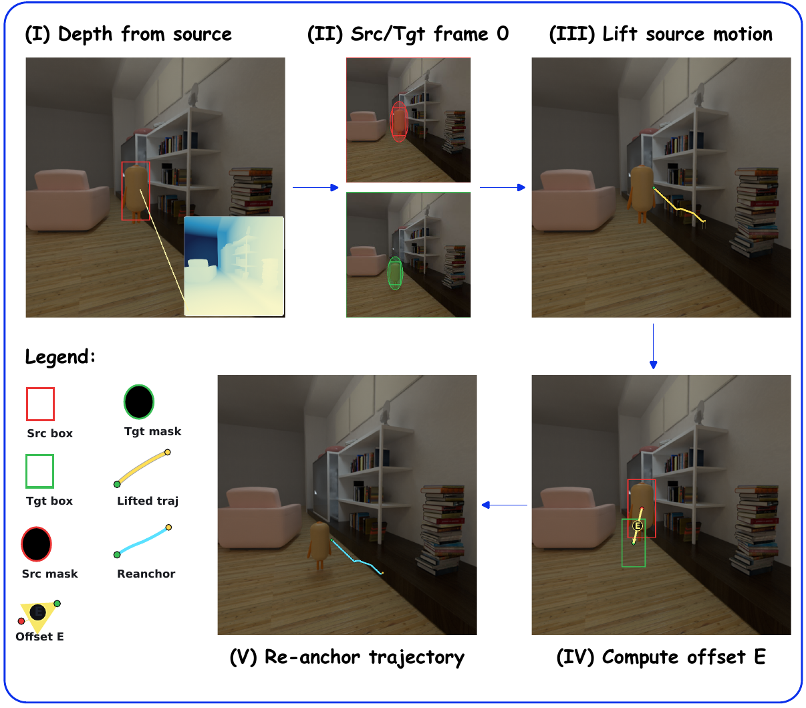
      <p align="justify">
        <em><strong>Common baseline repurposing pipeline.</strong> We convert each source-target case into method-specific controls. We estimate source depth, extract source and target frame-0 masks, lift source object motion to a 3D trajectory proxy, compute the frame-0 displacement <code>E</code>, and re-anchor the trajectory to the target start. Red indicates source localization, green indicates target localization, and trajectory overlays visualize source and re-anchored motion elements used for downstream baseline control conversion.</em>
      </p>
    </td>
  </tr>
</table>

## Qualitative Results

<details>
<summary><strong>Original Data</strong></summary>
<br>
Ground-truth source-target pairs and occlusion-aware segmentation channels.<br>
<sub>Note: Segmentation masks are occlusion-aware.</sub><br><br>
<strong>Motion trajectory: throw</strong><br>
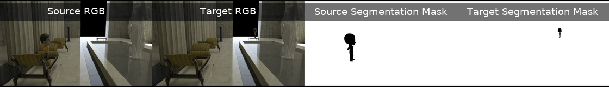<br><br>
<strong>Motion trajectory: throw</strong><br>
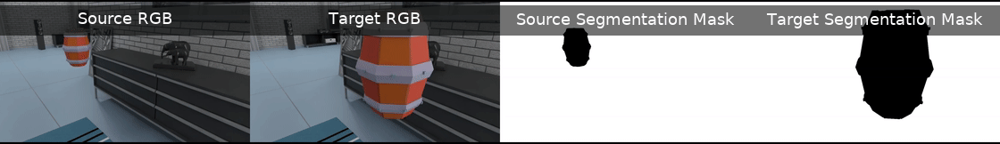<br><br>
<strong>Motion trajectory: drop</strong><br>
<br><br>
<strong>Motion trajectory: drag</strong><br>

</details>

<details>
<summary><strong>Baselines</strong></summary>
<br>
Comparison against <a href="https://anytraj.github.io/">ATI</a>, <a href="https://igl-hkust.github.io/das/">DaS</a>, <a href="https://i2vedit.github.io/">I2VEdit</a>, <a href="https://shapeformotion.github.io/">SFM</a>, and <a href="https://ali-vilab.github.io/VACE-Page/">VACE</a>.<br><br>
<strong>Motion trajectory: drop</strong><br>
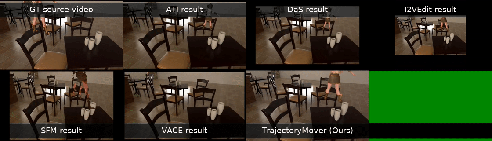<br><br>
<strong>Motion trajectory: drop</strong><br>
<br><br>
<strong>Motion trajectory: drop + drag</strong><br>
<br><br>
<strong>Motion trajectory: drop + drag</strong><br>
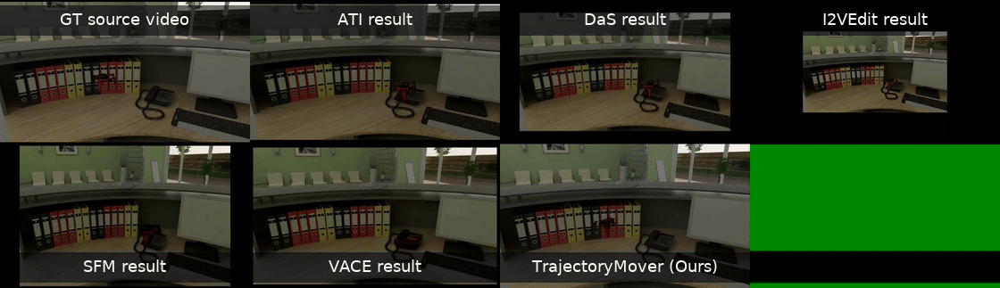
</details>

<details>
<summary><strong>Additional Our Results</strong></summary>
<br>
Additional TrajectoryMover results with input displacement control signal.<br><br>
<strong>Motion trajectory: drop</strong><br>
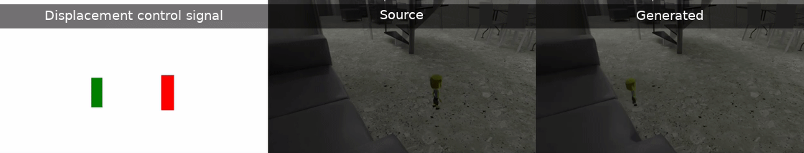<br><br>
<strong>Motion trajectory: drop</strong><br>
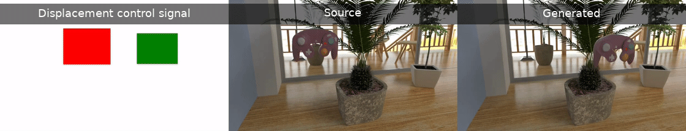<br><br>
<strong>Motion trajectory: drop + drag</strong><br>
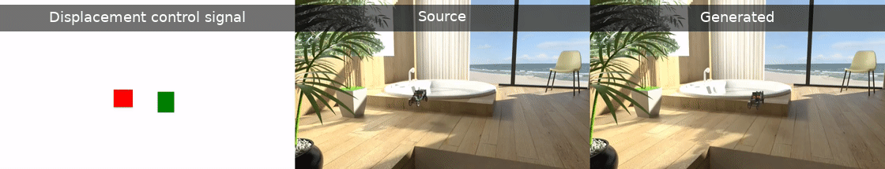<br><br>
<strong>Motion trajectory: drop</strong><br>
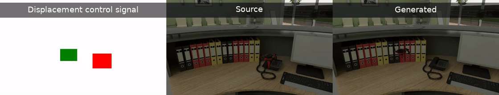
</details>

<details>
<summary><strong>Ablations</strong></summary>
<br>
Ablation comparisons for object diversity, scene-modification strategy, and trajectory diversity.<br><br>
<strong>Motion trajectory: drop</strong><br>
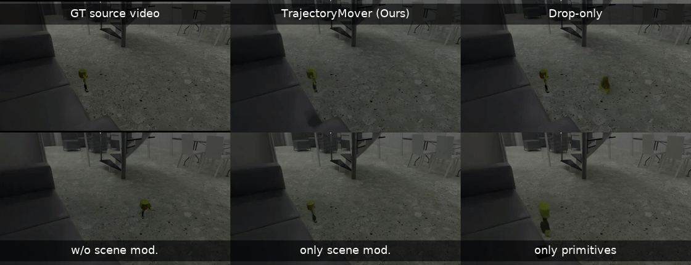<br><br>
<strong>Motion trajectory: drop</strong><br>
<br><br>
<strong>Motion trajectory: drop + drag</strong><br>
<br><br>
<strong>Motion trajectory: drop</strong><br>
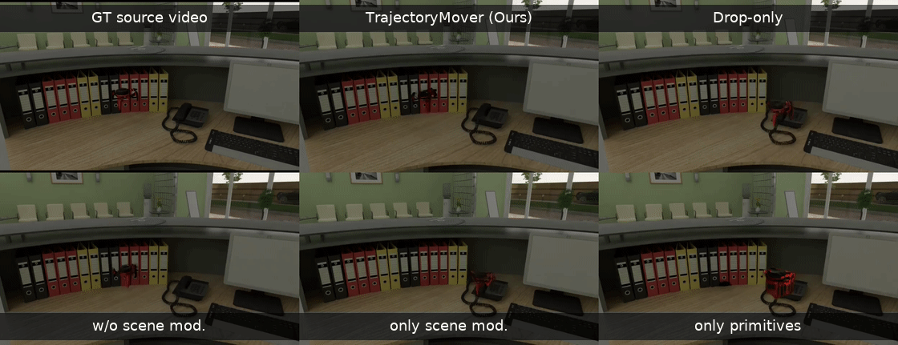
</details>

## BibTeX

```bibtex
@misc{chhatre2026trajectorymovergenerativemovementobject,
      title={TrajectoryMover: Generative Movement of Object Trajectories in Videos}, 
      author={Kiran Chhatre and Hyeonho Jeong and Yulia Gryaditskaya and Christopher E. Peters and Chun-Hao Paul Huang and Paul Guerrero},
      year={2026},
      eprint={2603.29092},
      archivePrefix={arXiv},
      primaryClass={cs.CV},
      url={https://arxiv.org/abs/2603.29092}, 
}
```

## Acknowledgements

We thank [Valentin Deschaintre](https://valentin.deschaintre.fr/) and [Iliyan Georgiev](https://iliyan.com/) for insightful discussions and valuable feedback. We are also grateful to [Yannick Hold-Geoffroy](https://yannickhold.com/) and [Vladimir Kim](https://vovakim.com/) for their help with the assets used in dataset generation, and to [Zhening Huang](https://zheninghuang.github.io/) for support with the model pipeline. The core ideas for this project were developed while Kiran Chhatre was an intern at Adobe Research.
